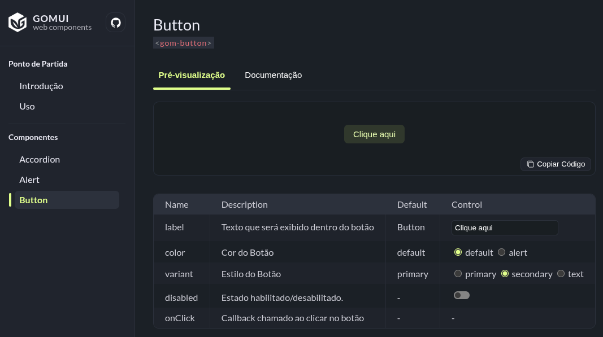

# GOMUI

**GOMUI** é uma biblioteca de Web Components, uma tecnologia versátil no desenvolvimento web moderno. O objetivo é disponibilizar elementos HTML personalizados que mantenham um design consistente e funcionem bem em diversos contextos.

👉 **Site/Documentação**: [ui.gommota.com](https://ui.gommota.com/)



Este repositório contém:

-   O **site** que lista e documenta os componentes.
-   A lógica necessária para **exportar e utilizar** componentes em outros projetos.

---

## 🚀 Criando um novo componente

Cada componente deve ter sua própria pasta, contendo 4 arquivos:

```bash
src/components/[nome-do-componente]/
  ├── config.json   # Propriedades e slots que são exibidos na seção "Pré-visualização"
  ├── doc.md        # Documentação em markdown (limitado aos marcadores da função markdownToHtml)
  ├── index.js      # Classe principal do componente
  └── styles.css    # Estilos específicos
```

### Estrutura mínima do `index.js`

Crie a classe do componente e estenda de `GomElement` para herdar utilitários como carregamento automático de estilos, e etc...

```js
import { GomElement } from '/src/components/index.js'

class GomExample extends GomElement {
	constructor() {
		super()
		this.loadStyles('/src/components/gom-example/styles.css')
	}

	connectedCallback() {
		this.shadowRoot.innerHTML = /*html*/ `
			<div class="example"> <slot></slot> </div>
		`
	}
}

customElements.define('gom-example', GomExample)
```

> **Dica**: use um componente existente como base, por exemplo `src/components/gom-alert/index.js`.

### Estrutura do `config.json`

```json
// Example

{
	"properties": {
		"title": {
			"description": "Título exibido no componente",
			"type": "text",
			"default": "Meu título"
		},
		"variant": {
			"description": "Estilo do componente",
			"type": "radio",
			"options": ["primary", "secondary"],
			"default": "primary"
		}
	},
	"slots": {
		"detail": {
			"description": "Conteúdo adicional exibido abaixo do título",
			"default": "Texto de descrição aqui"
		},
		"children": {
			"description": "Conteúdo livre dentro da tag do componente"
		}
	}
}
```

📌 **Observação**:

-   **children** indica que o slot padrão `<slot></slot>` é aceito.
-   **type** aceitos em "properties" → `text` | `check` | `radio` | `select`.

### Registrando o componente

Exporte o novo componente dentro do objeto `exposes` no arquivo `src/components/index.js`, seguindo o padrão dos demais. Dessa forma ele irá aparecer no menu lateral e será possível utiliza-lo no projeto que fizer o uso da biblioteca.

---

## 📄 Criando uma nova página

Para adicionar uma página no site, crie o arquivo `src/pages/[nome-da-pagina]/index.js` e implemente o padrão abaixo:

```js
const MyPage = async () => {
	const render = () => {
		return /*html*/ `<div> <h1>Minha Página</h1> </div>`
	}

	const after_render = async () => {
		console.log('Página renderizada, ações extras aqui')
	}

	return {
		title: 'Título da Página',
		description: 'Descrição da página',
		render,
		after_render,
	}
}

export default MyPage
```

### Registrando a rota

No arquivo `src/app.js`, adicione a nova página no objeto `ROUTES`:

```js
export const ROUTES = {
	'/caminho-da-pagina': {
		name: 'MyPage', // nome identico ao da pasta criada em "pages"
		label: 'Minha Página',
		nav: true, // define se a página deve aparecer no menu lateral
	},
}
```

> Para detalhes do funcionamento de páginas **SPA** no **GitHub Pages**, veja a implementação dos arquivos abaixo ou acesse o repositório [spa-github-pages](https://github.com/rafgraph/spa-github-pages).
>
> -   [404.html](404.html)
> -   [app.js](src/app.js) → `handleGithubPages404File()`

---

## 🛠️ Dicas de Desenvolvimento

-   [es6-string-html](https://marketplace.visualstudio.com/items?itemName=Tobermory.es6-string-html) → melhora a visualização da sintaxe HTML dentro de template strings do Javascript.
-   [Live Server](https://marketplace.visualstudio.com/items?itemName=ritwickdey.LiveServer) → executa um servidor local para testar alterações em tempo real.

---

## 🤝 Contribuições

Contribuições são bem-vindas!

Se você encontrou um bug, tem uma sugestão de melhoria ou quer adicionar novos componentes, sinta-se à vontade para colaborar. Faça um [fork](https://github.com/gom-mota/gomui/fork) do repositório e abra uma Pull Request para avaliação.
